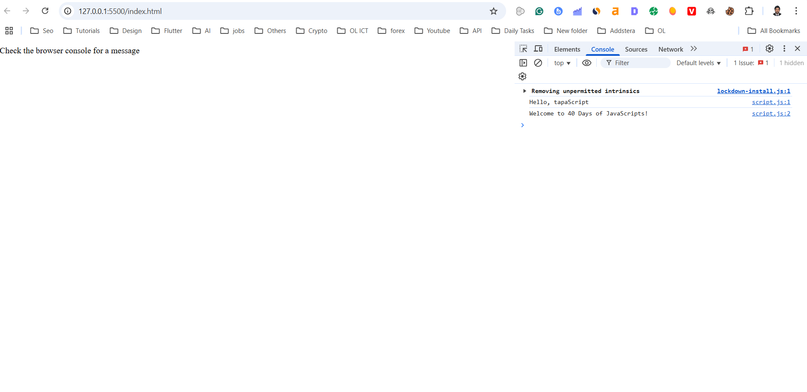

# Day 01 - 40 Days of JavaScript

## **🎯 Goal of This Lesson**

- Welcome to the "40 Days of JavaScript" series!
- How to follow the progress tracker?
- What is JavaScript, and why should you learn it?
- Setting up your development environment (VS Code, browser, and Node.js).
- Writing and running your first JavaScript code.
- Loading JavaScript in different ways (`async`, `defer`).
- Quick roadmap of what’s coming in this series.
- Task and How to Submit

## **👩‍💻 🧑‍💻 Assignment Tasks**

### ✅ Task 1: Setting Up Your Environment

1. Install VS Code (if not installed).
2. Set up Live Server or open the HTML file directly in a browser.
3. Open the DevTools Console (Right-click → Inspect → Console).

### ✅ Task 2: Write Your First JavaScript Code

1. Create a new file: index.html.
2. Add a `<script>` tag inside the HTML file or link an external `script.js`.
3. Inside `script.js`, write a simple greeting program:

   ```js
   console.log("Hello, tapaScript!");
   console.log("Welcome to 40 Days of JavaScript!");
   document.write("Check the browser console for a message!");
   ```

   

4. Run the HTML file in the browser and check:

- The console log prints the text.
- The document.write() outputs text on the webpage.

### ✅ Task 3: Experiment with Different JavaScript Loading Methods

1. Add the script in `<head>`, end of the `<body>` tag.
2. Use `async` and `defer` attributes
3. Understand the difefrences.

Answers

1. Even though it was used `<head>`, end of the `<body>` tag the end result was the same.
2. The following error message was displayed when `async` and `defer` both attributes were used.
   
